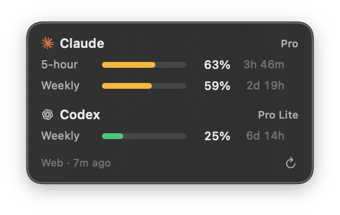
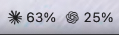

# Usage Overlay

A macOS menu bar app that keeps your **Claude** and **Codex** rate-limit usage on screen at all times.



Each row is one rate-limit window: **how much of it is left**, and when it resets. Percentages count down, not up — 39% means you have 39% of that window still available. The bar drains and turns amber below 50%, red below 20%.

The footer shows the age of the numbers once they go stale, plus a refresh button.

Your tightest remaining headroom per provider also sits in the menu bar, tagged with the window it came from — `5h 39%` means 39% of the 5-hour window is left, `7d 62%` means the weekly one:



Which window it follows, which providers appear, and how much detail is shown are all configurable — see [Menu bar](#menu-bar). Hovering the item lists **every** window of both providers with plan and reset time, whatever the menu bar itself is set to.

---

## How it works

The app never talks to Anthropic or OpenAI itself. It runs the two CLIs you already have and reads what they print.

### Claude — `claude -p "/usage"`

`/usage` is the same command you would type inside a Claude Code session, run non-interactively. It is a built-in command rather than a model turn: `--output-format json` reports `num_turns: 0`, `total_cost_usd: 0`, and zero tokens either way. **Checking your usage never spends any of it.**

What comes back is the text you would see in the TUI:

```
Current session: 46% used · resets Sep 2 at 1:09pm (Asia/Seoul)
Current week (all models): 5% used · resets Sep 3 at 4:59pm (Asia/Seoul)
```

The app reads every line beginning with `Current `. The name gives the window — `session` is the 5-hour one, `week` the weekly one, and some plans add per-model weekly windows — and the timezone in parentheses makes the reset time unambiguous. Percentages are the resilient part: if the reset wording ever changes, only the countdown is affected, and the last known reset time is kept rather than blanked.

The plan name is not in that output, so it comes from `claude auth status`, which prints JSON with `subscriptionType`. It is asked once per launch.

Each `claude -p` call leaves a session transcript behind — at one refresh a minute that would be 1,400 files a day. So the app passes its own `--session-id` and deletes exactly that file afterwards. The name is a UUID it generated moments earlier, so no other session's record can be caught by it.

### Codex — `codex app-server`

Codex has no usage subcommand, but the stdio JSON-RPC server behind its TUI does. The app speaks that protocol directly: `initialize`, `initialized`, then `account/rateLimits/read`.

```json
{"rateLimits": {"primary": {"usedPercent": 11, "windowDurationMins": 10080, "resetsAt": 1788848590},
                "secondary": null, "planType": "pro"}}
```

Structured, so there is nothing to parse loosely. Two things worth knowing:

- **`primary` and `secondary` do not tell you the window length.** On one plan `primary` is the 5-hour window, on another it is the weekly one. Labels come from `windowDurationMins` and nothing else.
- The response also carries per-model limits (`rateLimitsByLimitId`) and rate-limit reset credits. The overlay ignores both. One row per window is the point.

stdin has to stay open until the response arrives — close it and the server exits before answering.

### What used to be here

Two earlier approaches, both removed:

- **A hidden Chrome window** driven by AppleScript, calling each site's own usage API with the session you were already logged into. It worked, but it needed Chrome running and signed in, an Automation permission, and Chrome's **Allow JavaScript from Apple Events** setting — which, once on, lets *any* app with Automation permission run JavaScript in every session you are signed into. Too much to ask for a number in a menu bar.
- **The CLIs' own cache files** (`~/.claude.json`, Codex session rollouts). Free to read, but passive: they hold whatever the CLI last cached, so they go stale the moment you stop working. While this rewrite was being tested, the Claude cache on that machine was 19 hours old.

Running the CLIs costs neither of those things: live numbers, no browser, no permissions.

---

## Requirements

- macOS 14 or later
- **Claude Code CLI**, signed in — check with `claude auth status`
- **Codex CLI**, signed in — check with `codex login status`
- Xcode Command Line Tools (Swift 6) **only if you build from source**

Only use one of them? Turn the other off under **Menu Bar**; its overlay row will otherwise say the CLI wasn't found.

### Permissions the app needs

**None.** No Automation, no Accessibility, no Screen Recording, no Full Disk Access, no Camera, Microphone, or Location. The app runs two programs already on your Mac, as you, and reads their output.

### How it finds the CLIs

An app launched from Finder or at login gets a bare `PATH`, so `claude` and `codex` are not simply on it. The app looks where these CLIs actually install:

`~/.local/bin`, `/opt/homebrew/bin`, `/usr/local/bin`, `~/.claude/local`, `~/.bun/bin`, `~/.volta/bin`, `~/.cargo/bin`, `~/.npm-global/bin`, and every `~/.nvm/versions/node/*/bin`.

If yours lives somewhere else, point at it directly — no rebuild needed:

```bash
defaults write io.github.ginjae.usage-overlay path.claude '/your/path/to/claude'
defaults write io.github.ginjae.usage-overlay path.codex  '/your/path/to/codex'
```

### Files the app touches

One file per Claude refresh: the session transcript that `claude -p` writes, which the app then deletes by the UUID it passed in. Nothing else — it does not read your config files, session history, or credential stores.

---

## Privacy

- **The app makes no network requests of its own.** Each CLI talks to its own service with its own credentials, exactly as it does when you run it in a terminal.
- **It never handles your tokens.** Credentials stay wherever each CLI keeps them. The app does not read the keychain, `~/.codex/auth.json`, or any other credential store.
- **Nothing is sent anywhere.** No telemetry, no analytics, no remote logging.
- The only things stored on disk are your preferences (`io.github.ginjae.usage-overlay`): window position, opacity, refresh interval, and the menu bar settings.

---

## Install

### Download the app (recommended)

Download `Usage-Overlay-v*.zip` from the [latest GitHub Release](https://github.com/ginjae/usage-overlay/releases/latest), unzip it, and move **Usage Overlay.app** to `/Applications`.

The release is a Universal app, so it runs natively on both Apple Silicon and Intel Macs. It only links macOS system frameworks; Swift, Xcode, Homebrew, and other build dependencies are not required on the destination Mac.

Releases are currently ad-hoc signed, not Apple-notarized. On first launch, macOS may block the app because it cannot verify the developer. After trying to open it once, go to **System Settings → Privacy & Security → Security → Open Anyway**. A future Developer ID-signed and notarized release would remove this extra step.

### Build from source

Install Apple's Xcode Command Line Tools if needed:

```bash
xcode-select --install
```

Then clone the repository and build the app:

```bash
./scripts/bundle.sh              # release build → build/Usage Overlay.app (ad-hoc signed)
open "build/Usage Overlay.app"
```

Pass `--universal` to build for both Apple Silicon and Intel instead of only the current Mac. Release builds also accept `APP_VERSION=1.2.3` and `BUILD_NUMBER=123`.

The app icon is generated during bundling: `sips` and `iconutil` slice `Resources/AppIcon.png` into every size macOS asks for. Replace that one 1024×1024 PNG to change the icon; `Resources/AppIcon-source.png` is the original artwork it was cut from, kept so the icon can be re-cropped later. If either tool is missing the build still finishes, just with the generic icon.

For everyday use, move `build/Usage Overlay.app` to `/Applications` and turn on **Launch at Login** from the menu. If the required Apple build tools are missing, the script now stops with an installation hint instead of an opaque compiler error.

Maintainers can publish a prebuilt release by pushing a three-part version tag. For example:

```bash
git tag v0.2.0
git push origin v0.2.0
```

GitHub Actions builds the Universal app, creates a zip and SHA-256 checksum, and attaches both to a new GitHub Release.

To confirm both providers are being read, hover the menu bar item: the tooltip lists every window of both, with plan names and — if a provider has stopped answering — how old its numbers are.

---

## Menu bar

Clicking the menu bar item opens:

| Item | What it does |
|---|---|
| **Show Overlay** | Toggle the floating panel |
| **Click Through** | Let mouse events pass to the window underneath (you can't drag the overlay while this is on, so position it first) |
| **Opacity** | 100 / 85 / 70 / 50% |
| **Refresh Interval** | 30s / 1 min / 5 min / 10 min / 30 min |
| **Menu Bar** | What the status item itself shows — see below |
| **Refresh Now** / **Reset Position** / **Launch at Login** / **Quit** | |

Thirty seconds is the floor because every refresh starts two processes and asks two services. Below that you would spend a second of CPU on a number that has barely moved.

The overlay is dragged by its background, floats above other windows on every Space including full screen, and remembers its position by top-left corner.

### Menu Bar submenu

| Option | What it does |
|---|---|
| **Show Claude** / **Show Codex** | Which providers appear. Turn one off if you only use the other, or to save width |
| **Tightest Window** | Follow whichever window has the least left — the default, and why the number can jump between windows |
| **5-hour Window** / **Weekly Window** | Pin one window instead. A provider that doesn't report it falls back to its tightest, so the item never goes blank |
| **All Windows** | Every window of every provider. The icon goes on the first one only, and windows of the same provider are joined by a `·` — the gap alone can't say where one provider ends |
| **Percent Left** / **Percent Used** | Count down (default, matching the overlay) or up |
| **Window Label** | Prefix the window length: `5h 39%` instead of `39%` |
| **Provider Icon** | The Claude / OpenAI mark before each provider |
| **Reset Time** | Append the countdown: `5h 39% · 2h 10m`. With **All Windows** the joining `·` is dropped, since each window already carries one |

Turning both providers off leaves a plain `Usage` label, so the menu is still reachable. The tooltip ignores all of these and always shows everything.

---

## How it runs the CLIs

Deliberate rules:

- **Both providers are read in parallel.** One after the other would double the wait; together a refresh takes about a second.
- **One refresh at a time.** While a refresh is in flight the timer's next tick is skipped, so a slow or hung CLI can never pile up processes.
- **`USER` is set explicitly in the child environment.** With an empty `USER`, `claude -p "/usage"` prints *nothing at all* — no numbers, no error — and an app launched by launchd can have exactly that. The symptom looks like a broken app rather than a missing variable. This cost hours; it's noted here so it doesn't again.
- **The working directory is your home**, never the app bundle, so neither CLI mistakes the bundle for a project it should read.
- **Every call has a 30-second timeout.** On timeout the process is terminated and the previous numbers stay on screen with their age in the footer.
- **Failure is per provider.** If Claude times out while Codex answers, Codex still updates.
- **Only the transcript it created is deleted.** The file name is the UUID passed to `--session-id`, so the app can't touch a session it didn't start.

---

## Limitations

- Claude's `/usage` output is written for people, not parsers. A wording change could break it — percentages last, since the reset phrasing is the fragile half. When a refresh brings back a percentage but no reset time, the previous reset time is kept rather than blanking the countdown.
- `codex app-server` is marked experimental. The method name could change.
- A refresh starts two processes, so it isn't instant and the shortest interval is 30 seconds.
- If a CLI isn't installed or isn't signed in, that provider's row says so instead of showing numbers.
- Both CLIs must be signed in on this Mac. There is no API-key path — these are subscription rate limits.
- Screen capture tools will include the overlay.

---

## Project layout

| File | Role |
|---|---|
| `CommandRunner.swift` | Finds each CLI and runs it — install-location search, child environment, timeouts, reading stdout until the line we want |
| `ClaudeReader.swift` | `claude -p "/usage"` — text parsing, reset-time parsing, plan lookup, transcript cleanup |
| `CodexReader.swift` | `codex app-server` — the JSON-RPC handshake and the rate-limit response |
| `Models.swift` | `Gauge` / `ProviderUsage` / `Snapshot`, and the duration and freshness formatting |
| `UsageStore.swift` | 1-second clock, N-second refresh, parallel reads, keeping the last good numbers when a read fails |
| `OverlayPanel.swift` / `OverlayView.swift` | The floating HUD |
| `AppDelegate.swift` | Menu bar item and menu |
| `MenuBarText.swift` | Turns a snapshot into the menu bar text and tooltip, per the Menu Bar settings |
| `Icons.swift` | Provider icons as embedded template images |
| `Resources/AppIcon.png` | 1024px app icon master — the artwork cropped to its body and masked to the macOS icon shape, with the transparent margins the Dock expects. `bundle.sh` turns it into `AppIcon.icns` at build time |
| `Resources/AppIcon-source.png` | The original square artwork, before cropping and masking |
| `StatusBarImage.swift` | Composites icon + percentage into one menu bar image |
