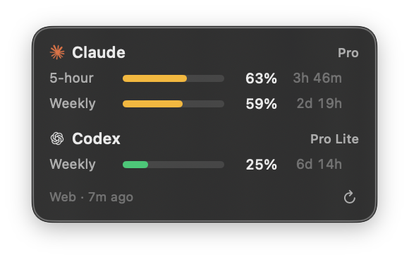
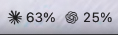

# Usage Overlay

A macOS menu bar app that keeps your **Claude** and **Codex** rate-limit usage on screen at all times.



Each row is one rate-limit window: **how much of it is left**, and when it resets. Percentages count down, not up — 39% means you have 39% of that window still available. The bar drains and turns amber below 50%, red below 20%.

Your tightest remaining headroom also sits in the menu bar, tagged with the window it came from — `5h 39%` means 39% of the 5-hour window is left, `7d 62%` means the weekly one. Hover it to see every window of both providers:



The numbers come from the CLIs you already have, refreshed every 5 minutes. Checking your usage never spends any of it.

## Install

Download `Usage-Overlay-v*.zip` from the [latest release](https://github.com/ginjae/usage-overlay/releases/latest), unzip it, and move **Usage Overlay.app** to `/Applications`.

You need macOS 14 or later and both CLIs signed in — check with `claude auth status` and `codex login status`. Only use one of them? Turn the other off under **Overlay → Providers** and **Menu Bar → Providers**, and it is never run at all.

Releases are ad-hoc signed rather than notarized, so macOS may block the first launch. After trying to open it once, go to **System Settings → Privacy & Security → Security → Open Anyway**. Only the first launch needs this.

## Menu

| Item | What it does |
|---|---|
| **Refresh Now** | Read both CLIs immediately |
| **Show Overlay** / **Providers** / **Click Through** / **Opacity** / **Reset Position** | The floating panel: whether it shows, which providers are in it, whether clicks pass through to the window underneath, and how opaque it is |
| **Menu Bar** | What the status item shows — which providers, which window (tightest, 5-hour, weekly, or all), percent left or used, and whether to add the window label, provider icon, and reset countdown |
| **Refresh Interval** | 30s / 1 min / 5 min / 10 min / 30 min |
| **Updates** | Current version, check now, and whether to check daily |
| **Launch at Login** / **Quit** | |

The overlay is dragged by its background, floats above other windows on every Space including full screen, and remembers where you left it.

## Updates

The app checks for a new version once a day and asks before installing one — **Update**, **Later**, or **Skip This Version**. It verifies the download against the checksum published with the release, then replaces itself and reopens, so **Open Anyway** never comes back. Run a check yourself, or turn the daily one off, under **Menu → Updates**.

## Privacy

The app makes no network requests except that update check, which carries nothing identifying and can be turned off. Your usage is fetched by each CLI with its own credentials, exactly as when you run it in a terminal: the app never sees your tokens, and sends nothing anywhere.

## If something looks wrong

- **A row says the CLI wasn't found.** It is installed somewhere unusual — point at it directly, no rebuild needed:
  ```bash
  defaults write io.github.ginjae.usage-overlay path.claude '/your/path/to/claude'
  defaults write io.github.ginjae.usage-overlay path.codex  '/your/path/to/codex'
  ```
- **An update won't install.** The app can only replace itself where it can write, and not while macOS runs it from a read-only copy. Move it to `/Applications` and open it again.
- **The numbers look old.** The footer shows their age and a refresh button; **Refresh Now** is always in the menu.

## Build from source

```bash
xcode-select --install     # if the build tools are missing
./scripts/bundle.sh        # → build/Usage Overlay.app
```
